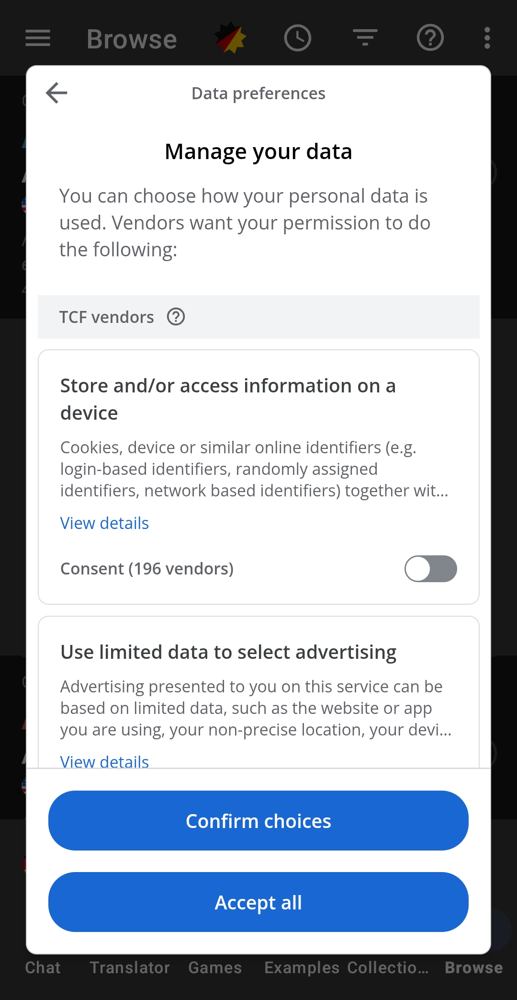

# ConsentGuard

```
 ██████╗ ██████╗ ███╗   ██╗███████╗███████╗███╗   ██╗████████╗
██╔════╝██╔═══██╗████╗  ██║██╔════╝██╔════╝████╗  ██║╚══██╔══╝
██║     ██║   ██║██╔██╗ ██║███████╗█████╗  ██╔██╗ ██║   ██║
██║     ██║   ██║██║╚██╗██║╚════██║██╔══╝  ██║╚██╗██║   ██║
╚██████╗╚██████╔╝██║ ╚████║███████║███████╗██║ ╚████║   ██║
 ╚═════╝ ╚═════╝ ╚═╝  ╚═══╝╚══════╝╚══════╝╚═╝  ╚═══╝   ╚═╝

 ██████╗ ██╗   ██╗ █████╗ ██████╗ ██████╗
██╔════╝ ██║   ██║██╔══██╗██╔══██╗██╔══██╗
██║  ███╗██║   ██║███████║██████╔╝██║  ██║
██║   ██║██║   ██║██╔══██║██╔══██╗██║  ██║
╚██████╔╝╚██████╔╝██║  ██║██║  ██║██████╔╝
 ╚═════╝  ╚═════╝ ╚═╝  ╚═╝╚═╝  ╚═╝╚═════╝
```

## What it does

ConsentGuard is an Android accessibility service that watches the screen for cookie and tracking consent prompts and automatically rejects them.

- It works in Chrome, embedded WebViews, and some native consent dialogues. What it can see varies between apps and websites.
- On a simple banner it taps the reject option, or the necessary only option.
- On a banner with a long list of individual switches, it switches off the optional ones one by one, then saves if the site asks for that. Switches marked as required or essential are left on.
- It requires no internet permission and collects no data. It keeps nothing except your settings.

I created ConsentGuard to spare myself the tedious ritual of hunting through the endless settings so generously provided by loving and caring advertising and analytics providers, such as the one below:



## Download

1. Download `ConsentGuard.apk` from the [Releases page](https://github.com/macbuildssys/ConsentGuard/releases).
2. Tap **Install**. Google Play Protect may warn you because the app is not from Google Play. Choose **More details**, then **Install anyway**, if you trust the source.
3. Open **ConsentGuard**. It shows whether the service is switched on.

### Install on Android 13 and later

Android can block accessibility services in apps installed from outside Google Play. This is called a restricted setting. If ConsentGuard is greyed out in the accessibility list, or Android shows a "Restricted setting" message when you try to switch it on, allow it like this:

1. Open the **Settings** app.
2. Tap **Apps**.
3. Tap **ConsentGuard**. If you cannot find it, tap **See all apps** or **App info** first.
4. Tap the three dot menu (**More**) and choose **Allow restricted settings**.
5. Follow the on screen instructions.
6. Go back to **Settings > Accessibility > Installed apps > ConsentGuard** and turn it on.

If the **Allow restricted settings** option is not there, first try turning the service on once. Android then shows the restricted setting message, and the option appears in the app's menu afterwards.

The exact wording and location can vary between Android versions and device makers. Google describes the steps here: [Restricted settings on Android](https://support.google.com/android/answer/12623953).

## Using it

Once the service is on, there is nothing more to do. Browse as usual and ConsentGuard handles prompts as they appear.

- If ConsentGuard is not sure that every optional switch is off, it does not press Save or Confirm and leaves the panel as it is, so you can finish it yourself.
- **Choose what to reject** lets you decide which groups are switched off: ad tracking, tracking for stats, and everything else that is optional. All are on by default.
- To update, install the newer `ConsentGuard.apk` over the old one, then check that the service is still switched on.
- To stop it, switch it off under **Settings > Accessibility > Installed apps > ConsentGuard**, or uninstall the app.

## Best effort

ConsentGuard works on a best effort basis. It can miss some banners and switches, and it cannot promise that a site stops tracking you or that any law is met. Read the full [best effort statement](docs/BEST_EFFORT.md).

## License

Distributed under the MIT License. See [LICENSE](LICENSE).
